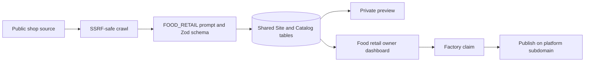

# FOOD_RETAIL vertical

`FOOD_RETAIL` covers independent bakeries, pâtisseries, butchers, delis,
cheesemongers, grocers and similar local food shops. It is a retail storefront,
not a full-service restaurant mode.

## System flow

## Vertical boundary

- Product ranges use the shared `CatalogSection` / `CatalogItem` relations.
- `Site.attributes` stores `shopType`, product-gallery preference and sourced
  pickup details.
- The shared nullable `CatalogItem.available` column stores an evidence-backed
  stock fact. `CatalogItem.attributes.visible` independently controls storefront
  inclusion; unknown stock does not hide a product.
- `CatalogItem.attributes` also stores the stock evidence URL, seasonal
  availability, explicit preorder state/note, allergens and allergen evidence.
- Ordering, click-and-collect and preorder URLs use the shared `ORDERING`
  integration. Courier marketplaces use `DELIVERY`.
- The renderer selects ordering as the primary mobile CTA and sets booking
  request mode to `never`. No missing-link fallback can create a reservation
  form.
- Store address and hours remain the shared canonical fields. Empty means the
  source did not provide the fact.

## Factuality contract

The importer and owner-save schema enforce these rules:

- no invented products, prices, stock, seasonal dates, preorder requirements,
  pickup promises or allergens;
- `price: null`, `available: null`, `preorderRequired: null`, empty strings and
  empty arrays are the normal unknown state;
- shared `available` can become `true` or `false` only with an exact HTTPS
  `stockSourceUrl`; `attributes.visible` independently controls storefront
  inclusion, so unknown and out-of-stock products can remain visible;
- after model generation, canonical identity, contact details, hours, product
  ranges, prices, integrations and FOOD_RETAIL claim attributes are replaced
  with deterministic crawl output; unsupported model claims fail closed to the
  documented unknown values;
- any non-empty `allergens` array is invalid unless `allergenSourceUrl` is an
  exact HTTPS source URL;
- only source/owner/permissioned photography can be persisted, and enhancement
  cannot change the product, portion, package, label, finish or price sign;
- English/French translations change text only. Product order, prices,
  currencies, image references, integration URLs and allergen evidence stay
  canonical.
- Owner-added categories and products require a sourced canonical name before
  they are created. Locale overlays temporarily reuse that nonblank source text,
  remain `stale`, and cannot publish until the localized editor is completed and
  explicitly marked reviewed. Imported/generated overlays default to `draft`.

## Structured data

Live pages emit Schema.org JSON-LD only on the analytics-enabled public surface:

- `Bakery` for bakery and pâtisserie;
- `GroceryStore` for grocers;
- `Store` plus a precise `category` for butchers, delis, cheesemongers and the
  safe generic type;
- `OfferCatalog` / `Offer` / `Product` for visible, actually stored catalog
  entries, with Schema.org stock availability only when the status has source
  evidence;
- `OrderAction` only when a persisted ordering or delivery integration exists;
- price and currency only when the source-backed price is non-null.

The markup never emits `acceptsReservations` and deliberately omits allergen
claims: their source remains available to the owner/editor, but there is no
generic Schema.org product-allergen property that justifies publishing them as
an unqualified product fact.

## Persistence and migration

Migration `20260820210000_food_retail_vertical` adds the enum value only, after
the shared nullable-availability migration from #111.
Existing generic JSON attribute bags and catalog/integration relations already
carry the vertical data, so no existing rows are rewritten and the migration
does not seed product facts. The owner PUT route parses FOOD_RETAIL drafts with
the registered schema before the shared optimistic-revision persistence path.

## Capability row

Matches the README matrix and `resolveOwnerOperations(FOOD_RETAIL)`:

| Vertical | Factory visibility | Standalone launch | Claim mode | Owner mutation | Platform publication | Custom domains | Monitoring | Leads | Articles |
| --- | --- | --- | --- | --- | --- | --- | --- | --- | --- |
| Food Retail | private | unlaunched | factory | enabled | enabled | enabled | enabled | not-yet | not-yet |

Owner photo library is enabled. Owner analytics, lead inbox, and articles stay
`not-yet`. This vertical does not inherit restaurant reservations or booking
leads.

## Factory claim and standalone launch gates

Standalone niche marketing stays closed:

- `marketing.hostnames = []`
- `marketing.domain = null`
- `marketing.email = null`
- `marketing.publiclyAccessible = false`
- `claimMode = "factory"`
- `publicationEnabled = true`
- `publicationMutationEnabled = true`

An approved private preview can claim the shared Cornershopdev €49 plan and
publish at `<slug>.cornershop.dev`. That factory path requires:

- [x] platform wildcard DNS and on-demand TLS cover the shared public URL;
- [x] `send.cornershop.dev` and the receiving-only root `cornershop.dev`
      identities are provider-verified;
- [x] production billing product/price and checkout configuration are present in
      the reviewed environment without secret values entering git;
- [x] production readiness covers database migration status, Redis, storage,
      billing, email and alerting;
- [x] English and French fixture/import/renderer/dashboard tests pass;
- [ ] the specific owner has reviewed every product, price, hours, pickup
      wording, image, stock statement, translation and allergen source before
      publishing that business.

FOOD_RETAIL remains excluded from `listMarketingVerticals()` until it owns a
standalone niche domain and sender. That does not block an evidence-reviewed
owner from claiming through the factory, editing with revision protection and
publishing an immutable snapshot on the platform subdomain.
